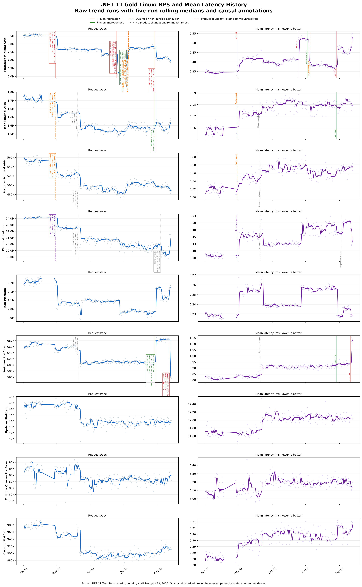
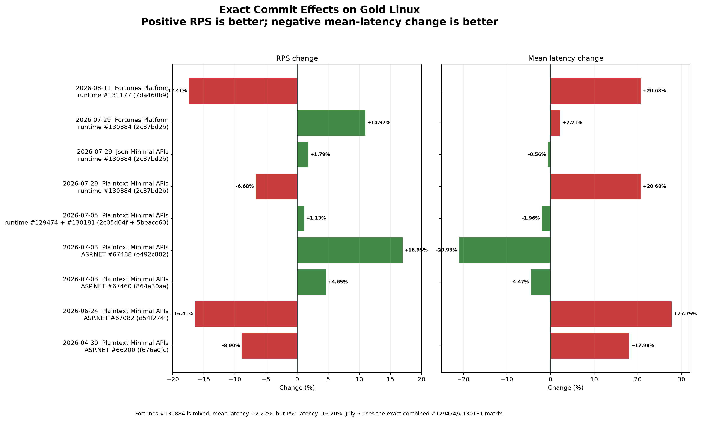

# .NET 11 Gold Linux RPS Improvements

Three historical throughput improvements were investigated with controlled
parent/candidate overlays and balanced reruns.

## Annotated charts

The historical chart includes all nine .NET 11 Gold Linux trend scenarios.
Solid red and green annotations have exact parent/candidate commit evidence.
Orange annotations are qualified, gray annotations had identical artifacts,
and purple annotations are reproduced product boundaries whose exact commit
has not been isolated.

The exact-effect chart uses controlled parent/candidate results. Fortunes
#130884 is intentionally shown as mixed: mean latency increased 2.22%, while
P50 latency improved 16.20%.

## Current .NET 10 to .NET 11 outcome

The latest paired Gold Linux baselines compare
`.NET 10.0.11+e2f47b0110ed` with
`.NET 11.0.0-rc.1.26411.119+7cdb21744590`. Across the four materially
regressed RPS scenarios, the equal-weight RPS change is **-10.90%**.

| Scenario | RPS: .NET 10 -> .NET 11 | Mean latency: .NET 10 -> .NET 11 | Regression causes and offsets |
| --- | ---: | ---: | --- |
| Plaintext Minimal APIs | 8.032M -> 6.920M (**-13.84%**) | 0.356 -> 0.539 ms (**+51.52%**) | Proven regressions: ASP.NET [#66200](https://github.com/dotnet/aspnetcore/pull/66200) `f676e0fc` (**-8.90% RPS**), ASP.NET [#67082](https://github.com/dotnet/aspnetcore/pull/67082) `d54f274f` (**-16.41%**), and runtime [#130884](https://github.com/dotnet/runtime/pull/130884) `2c87bd2b` (**-6.68%**). Proven offsets: ASP.NET #67460 (**+4.65%**), ASP.NET #67488 (**+16.95%**), and runtime #129474 plus #130181 (**+1.13%**). The known exact chain compounds to approximately **-12.04%**, leaving about **-2.04%** multiplicative residual. |
| Json Minimal APIs | 1.617M -> 1.583M (**-2.09%**) | 0.164 -> 0.179 ms (**+8.77%**) | The April runtime-async boundary controlled at **-3.12% RPS** and has the same allocation signature as #66200; exact commit isolation was performed on Plaintext. Runtime #130884 offsets **+1.79% RPS** and **-0.56% mean latency**. A small residual remains. |
| Fortunes Minimal APIs | 526K -> 492K (**-6.58%**) | 0.529 -> 0.563 ms (**+6.57%**) | The April runtime-async boundary controlled at **-4.77% RPS** and matches the #66200 signature. No later exact offset was isolated; **1.81 .NET 10 index points** remain unattributed. |
| Fortunes Platform | 719K -> 568K (**-21.07%**) | 0.748 -> 1.100 ms (**+47.05%**) | Runtime [#131177](https://github.com/dotnet/runtime/pull/131177) `7da460b9` is a proven **-17.41% RPS / +20.68% mean-latency** regression. Runtime #130884 offsets **+10.97% RPS** and improves P50 latency **16.20%**, although mean latency rises 2.22%. The remaining gap is not assigned to an exact product commit; the May historical drop used identical artifacts. |
| Plaintext Platform | 21.621M -> 21.357M (**-1.22%**) | 0.405 -> 0.421 ms (**+3.76%**) | The April product boundary reproduced at **-5.61% RPS**, but its exact commit remains unresolved. Later product improvements recover most of it. The May and August historical drops used identical artifacts and are environment or harness effects. |
| Caching Platform | 907K -> 899K (**-0.88%**) | 0.291 -> 0.313 ms (**+7.47%**) | No material RPS regression. The latency-only regression has not been commit-bisected. |
| Json Platform | 2.160M -> 2.179M (**+0.85%**) | 0.229 -> 0.229 ms (**+0.03%**) | Overall neutral to improved; no material regression to attribute. |
| Multiple Queries Platform | 81.6K -> 83.3K (**+2.04%**) | 6.25 -> 6.12 ms (**-2.08%**) | Overall improved. |
| Updates Platform | 43.1K -> 43.7K (**+1.51%**) | 12.23 -> 11.98 ms (**-2.04%**) | Overall improved. |

The exact effects compound and can interact, so their percentages should not
be added directly. For Json and Fortunes Minimal APIs, #66200 is the
best-supported commit attribution from the shared April boundary and matching
allocation signature; the exact parent/candidate payload proof was run on
Plaintext Minimal APIs.

| Boundary | Historical change | Current result |
| --- | ---: | --- |
| July 3 Plaintext Minimal APIs | +21.051% | ASP.NET #67460 and #67488 compound to +22.433% |
| July 5 Plaintext Minimal APIs | +5.383% immediate, +3.53% sustained | Exact async changes combine to +1.126%; historical magnitude is not reproducible |
| July 29 Fortunes Platform | +13.008% | runtime #130884 reproduces +10.966% |

## July 3: avoid unnecessary request work

ASP.NET [#67460](https://github.com/dotnet/aspnetcore/pull/67460) gates
CSRF validation to endpoints that opt in:

- RPS: 6,455,882 to 6,755,846 (**+4.646%**).
- Mean latency: **-4.468%**.

ASP.NET [#67488](https://github.com/dotnet/aspnetcore/pull/67488) avoids
allocating `HttpContext.Items` on ordinary requests:

- RPS: 6,758,626 to 7,904,154 (**+16.949%**).
- Mean latency: **-20.935%**.
- Allocation rate: **-99.546%**.

Applied sequentially, the changes produce **+22.433%**, explaining 105.94% of
the historical boundary on a logarithmic scale.

## July 5: allocation improved, but the RPS cliff was not durable

A balanced rerun of the exact official before/after packages did not reproduce
the historical throughput increase:

- RPS: **-0.809%**, t=-2.0607.
- RPS with ReadyToRun disabled: **-0.347%**, t=-0.5103.
- Allocation rate: **-59.447%**.
- Working set: **-4.467%**.

Runtime [#129474](https://github.com/dotnet/runtime/pull/129474) added 220
ReadyToRun methods to the ASP.NET payload: 216 async variants and 4 resume
variants. Opposite-order repetitions measured +2.1608% and -0.6254%. Their
order-balanced estimate is **+0.7581%**, with a batch-level t statistic of
0.9066. The binary mechanism is proven, but a stable standalone RPS gain is
not.

Runtime [#130181](https://github.com/dotnet/runtime/pull/130181) enables
tail-await optimization in Tier 0:

- Standalone RPS: **+0.7183%**, t=1.9087.
- Allocation rate: **-56.477%**.
- All 133 ASP.NET assemblies were byte-identical when recompiled with exact
  parent/candidate Crossgen2 tools, confirming this is a dynamic Tier 0 effect.

An exact 2x2 matrix combining the #129474 ReadyToRun payloads with the #130181
JITs measured:

- Combined RPS: 7,879,996 to 7,968,717 (**+1.126%**), t=3.0353.
- Symmetric #129474 effect: **+0.512%**.
- Symmetric #130181 effect: **+0.611%**.
- Interaction: **-1.389%**.
- Allocation rate: **-55.853%**.
- Mean latency: **-1.955%**.

Together these changes explain 21.35% of the historical immediate gain, or
32.27% of the sustained gain. The allocation improvement is real and
repeatable, but the historical RPS magnitude was sensitive to machine or run
state.

Exact Crossgen2 checks also eliminated runtime #127746 and #129325 as ASP.NET
ReadyToRun causes: each produced 133 byte-identical parent/candidate
assemblies.

## July 29: continuation placement is workload dependent

Runtime [#130884](https://github.com/dotnet/runtime/pull/130884) reproduced
most of the Fortunes improvement:

- Fortunes RPS: 612,555 to 679,725 (**+10.966%**).
- Fortunes P50 latency: **-16.204%**.
- Historical gain explained: **85.09%**.
- JSON RPS: **+1.791%**, explaining 49.73% of its historical gain.

The Pipelines split identified `preferLocal: true` as the workload
discriminator:

| Variant | Plaintext RPS | Fortunes RPS |
| --- | ---: | ---: |
| Full candidate | -6.592% | +9.754% |
| Candidate without local queues | +7.296% | -0.474% |
| Local queues only | -14.963% | +11.203% |

The lock, buffer-movement, and FIFO segment-pool changes help Plaintext and are
neutral on Fortunes. Local queues improve Fortunes while sharply regressing
Plaintext, so a blanket revert would discard a proven improvement.

## Engineering takeaways

1. Avoid unconditional per-request work and lazy-state materialization on hot
   paths.
2. Treat allocation and throughput as separate acceptance metrics.
3. Keep runtime-async ReadyToRun generation, but do not credit it with the
   historical July 5 RPS magnitude.
4. Make Pipelines continuation placement configurable or adaptive rather than
   universally preferring local queues.
